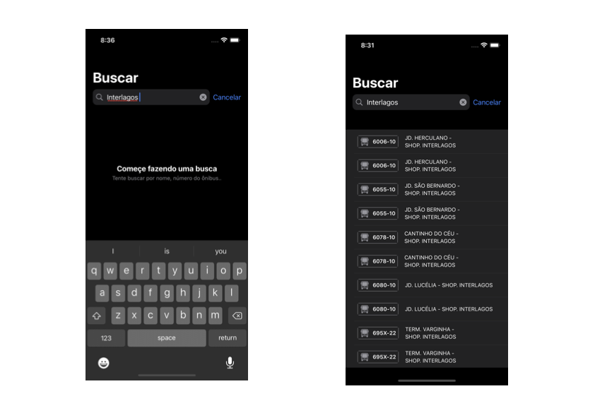

# BusaoShare

Jetpack Compose and SwiftUI based Kotlin Multiplatform sample project (based on [SPTrans API](https://www.sptrans.com.br/desenvolvedores/api-do-olho-vivo-guia-de-referencia/documentacao-api/)).

### Building

Note that, due to use of Jetpack Compose, Android Studio Arctic Fox and is required to build/run the Android client. 

Minimum of XCode 13.2 beta is required for iOS project as it now uses Swift 5.5 concurrency capabilities. When opening iOS and macOS projects remember to open `.xcworkspace` file (and not `.xcodeproj` one)

### iOS App

### Android App